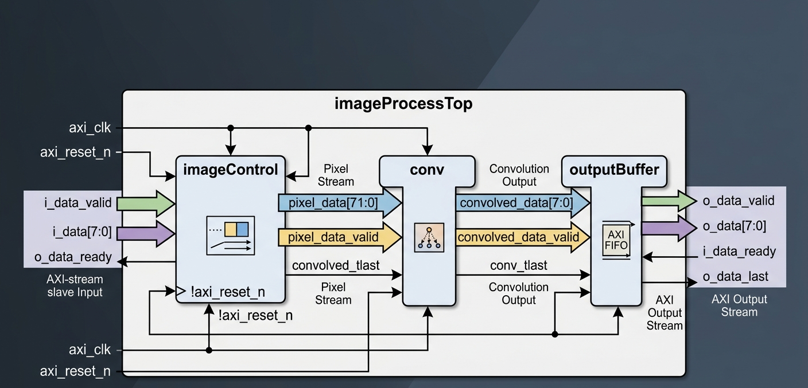
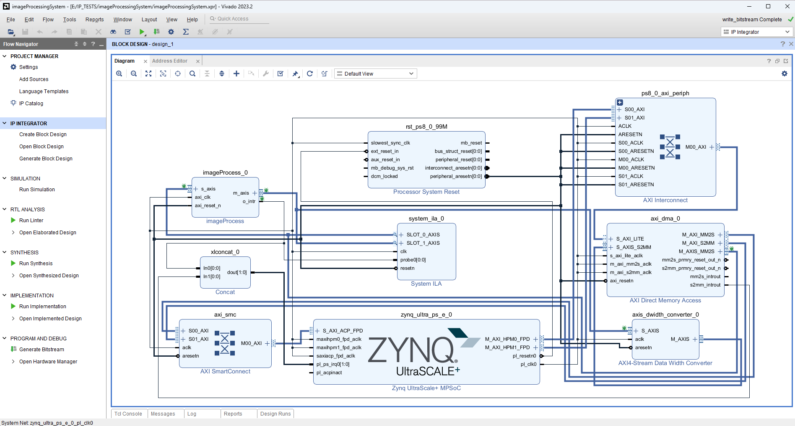

# FPGA-Based 2D Convolution Accelerator on ZCU102 

Real-time AXI-Stream based image processing accelerator implemented on FPGA.

<p align="center">

  
  
  
  
  
  

</p>

---

<p align="center">
  
</p>


---

## Overview

This project implements a hardware-based image processing pipeline in Verilog using an AXI-Stream style interface. The top-level module, `imageProcessTop`, connects multiple processing stages to receive image pixels, perform convolution-based filtering, and stream the processed output data.

The design is intended for FPGA-based real-time image processing applications and follows a modular streaming architecture for high-throughput operation.

---

# Top-Level Architecture

The pipeline consists of three major modules:

1. `imageControl`
2. `conv`
3. `outputBuffer`

Data flows sequentially through these blocks:

```text
Input AXI Stream
        │
        ▼
+----------------+
|  imageControl  |
+----------------+
        │ 72-bit windowed pixel data
        ▼
+----------------+
|      conv      |
+----------------+
        │ Filtered pixel stream
        ▼
+----------------+
|  outputBuffer  |
+----------------+
        │
        ▼
Output AXI Stream
```

---

# Module Description

## 1. imageControl

The `imageControl` module receives incoming 8-bit pixel data and prepares it for convolution processing.

### Responsibilities
- Accepts pixel stream input
- Generates sliding image windows
- Produces 72-bit pixel data for convolution
- Generates frame synchronization signals
- Raises interrupt signal after frame processing

### Inputs
- `i_pixel_data[7:0]`
- `i_pixel_data_valid`
- `i_clk`
- `i_rst`

### Outputs
- `o_pixel_data[71:0]`
- `o_pixel_data_valid`
- `o_tlast`
- `o_intr`

This stage is typically responsible for line buffering and neighborhood extraction required for spatial filtering operations such as 3×3 convolution.

---

## 2. conv

The `conv` module performs convolution on the incoming pixel window data.

### Responsibilities
- Applies convolution kernel/filter
- Processes 72-bit neighborhood pixel data
- Produces filtered 8-bit output pixels
- Maintains stream synchronization signals

### Inputs
- `i_pixel_data[71:0]`
- `i_pixel_data_valid`
- `i_tlast`
- `i_clk`

### Outputs
- `o_convolved_data[7:0]`
- `o_convolved_data_valid`
- `o_tlast`

This block can be extended to support:
- Edge detection
- Blur filters
- Sharpening
- Gaussian filtering
- Sobel operators

---

## 3. outputBuffer

The `outputBuffer` module acts as an AXI-stream output interface buffer.

### Responsibilities
- Buffers processed pixel data
- Handles AXI-stream handshake
- Synchronizes output transmission
- Passes frame-end (`tlast`) information

### AXI Stream Signals

#### Slave Side
- `s_axis_tvalid`
- `s_axis_tdata`
- `s_axis_tlast`

#### Master Side
- `m_axis_tvalid`
- `m_axis_tdata`
- `m_axis_tready`
- `m_axis_tlast`

This module enables smooth streaming of processed image data to downstream modules such as DMA engines, display controllers, or video interfaces.

---

# Interface Overview

## Input Interface

| Signal | Description |
|---|---|
| `i_data[7:0]` | Input pixel data |
| `i_data_valid` | Input data valid signal |
| `o_data_ready` | Ready signal for upstream source |

---

## Output Interface

| Signal | Description |
|---|---|
| `o_data[7:0]` | Processed output pixel |
| `o_data_valid` | Output data valid |
| `i_data_ready` | Downstream ready signal |
| `o_data_last` | End-of-frame / line indicator |

---

# Clock and Reset

| Signal | Description |
|---|---|
| `axi_clk` | System clock |
| `axi_reset_n` | Active-low reset |

The `imageControl` module internally uses an inverted reset signal:

```verilog
.i_rst(!axi_reset_n)
```


---

# AXI Stream Block Design

The following block design illustrates the AXI-Stream based hardware architecture implemented on the ZCU102 FPGA platform.

<p align="center">
  
</p>


---

## AXI Stream Architecture Overview

The design uses AXI-Stream interfaces for high-speed pixel data transfer between processing modules.

### Main Components
- AXI DMA
- Processing System (PS)
- AXI Interconnect
- Custom Convolution IP
- Output Buffer
- Memory Interface

### Data Flow

```text
DDR Memory
    │
    ▼
AXI DMA MM2S
    │
    ▼
Custom Image Processing IP
    │
    ▼
AXI DMA S2MM
    │
    ▼
DDR Memory
```


---
# Results

## Input vs Output Comparison

The following images demonstrate the effect of the 2D convolution accelerator implemented on the FPGA.

<p align="center">
  <table>
    <tr>
      <th>Input Image</th>
      <th>Processed Output</th>
    </tr>
    <tr>
      <td>
        
      </td>
      <td>
        
      </td>
    </tr>
  </table>
</p>

---
# FPGA Resource Utilization

| Resource | Utilization |
|---|---|
| LUTs | 9233 |
| Flip-Flops | 11522 |
| BRAM | 8 |
| DSP Slices | 0 |
| Clock Frequency | 100 MHz |

---
# Features

- AXI-stream compatible architecture
- Fully pipelined image processing flow
- Modular FPGA-friendly design
- Real-time streaming support
- Convolution-based filtering framework
- Interrupt generation support
- Scalable for advanced image processing applications

---

# Applications

This architecture can be used for:

- Real-time video processing
- FPGA vision systems
- Edge detection
- Image enhancement
- Embedded AI preprocessing
- Industrial inspection systems
- Autonomous robotics vision pipelines

---

# Repository Structure

```text
├── rtl/
│   ├── imageProcessTop.v
│   ├── imageControl.v
│   ├── conv.v
│   └── outputBuffer.v
│
├── simulation/
│   └── testbench
|         └── tb.v
|   └── lena_image
|         └── lena_gray.bmp
|         └── blurred_lena.bmp
├── architecture_diagram.png
├── block_diagram.png
└── README.md
```

---

# Final Notes

This project was developed to explore hardware-accelerated image processing using FPGA streaming architectures and AXI-based communication. It demonstrates the implementation of a real-time 2D convolution pipeline optimized for high-throughput embedded vision applications.

Future improvements may include:
- Multi-filter support
- RGB image processing
- Runtime programmable kernels
- DMA optimization
- AI/ML preprocessing acceleration

If you found this project interesting, feel free to ⭐ the repository or contribute to future enhancements.

---

